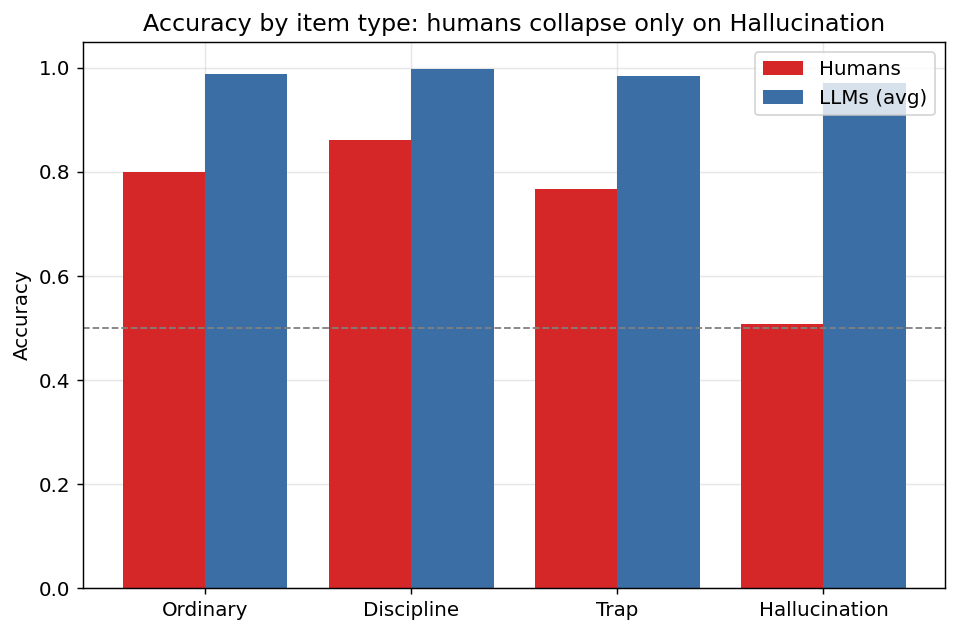
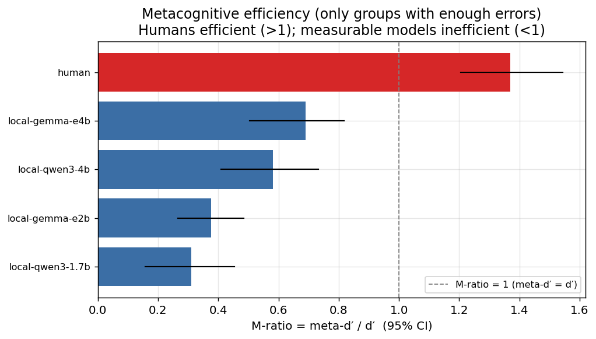
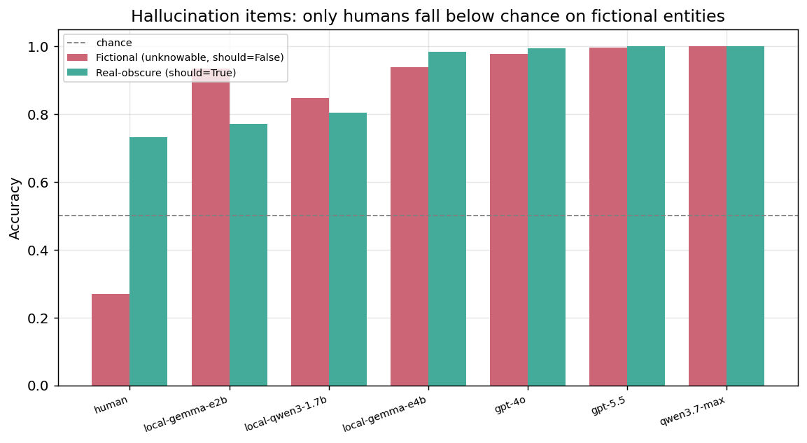
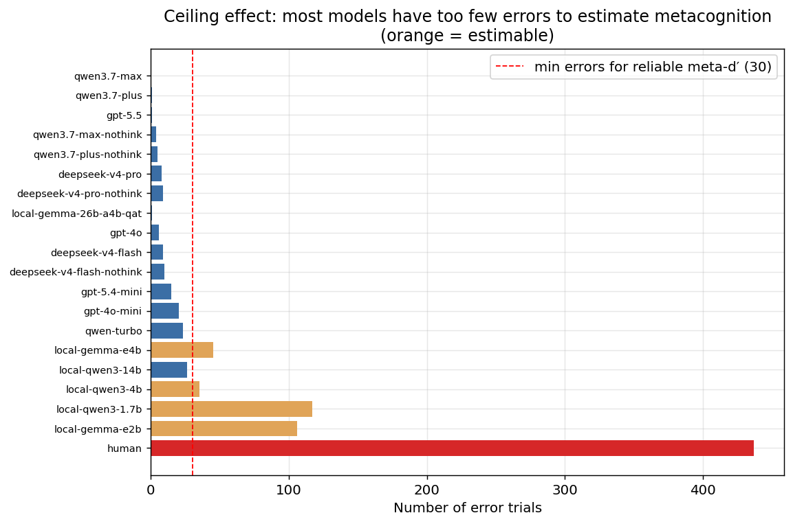

# SOCRATES

**S**elf-knowledge **O**f **C**onfidence: **R**ating **A**nd **T**esting **E**pistemic **S**ensitivity

> A symmetric behavioral study of how humans and large language models judge the boundaries of their own knowledge.
>
> 一项对称的行为实验：比较人类与大语言模型如何判断自身知识边界。

SOCRATES places humans and LLMs on the same 400-item True/False bank, asks both to report confidence on the same five-level scale, and analyzes their responses with the same calibration and signal-detection metrics. The study measures **reported confidence behavior**; it does not establish whether an LLM has an internal metacognitive mechanism equivalent to a human's.

SOCRATES 让人类与 LLM 回答同一套 400 道判断题，并用相同的五档量表报告信心，再使用同一套校准与信号检测指标进行分析。本研究测量的是**外显的置信度行为**，不能据此证明 LLM 内部存在与人类等同的元认知机制。

## Results at a glance / 核心结果

| Finding / 发现 | Result / 结果 | Interpretation / 解读 |
|---|---:|---|
| Human sample / 人类样本 | 46 participants; 1,647 valid responses; accuracy **0.735** | Humans answered the Chinese questionnaire. / 人类作答中文问卷。 |
| Model sample / 模型样本 | 20 configurations; most accuracy **0.97–1.00** | Models answered the English bank, creating the study's primary language confound. / 模型作答英文题库，构成本研究首要语言混淆。 |
| Expected Calibration Error (ECE) / 预期校准误差 | Humans **0.086 [0.062, 0.113]** | Difference-bootstrap ECE was significantly higher for humans than for **17/19** model configurations; the two weakest local models were not significantly different. / 差值自助检验显示，人类 ECE 显著高于 19 个模型配置中的 17 个；与两个最弱本地模型的差异不显著。 |
| M-ratio (`meta-d′/d′`) / M-ratio 元认知效率 | Humans **1.37 [1.21, 1.54]**; four data-driven models **0.31–0.69** | The intervals do not overlap, but most stronger models made too few errors for reliable MLE estimation. / 区间不重叠，但多数更强模型错误过少，无法可靠进行 MLE 估计。 |
| Fictional hallucination items / 虚构幻觉题 | Humans **0.269**; models **0.85–1.00** | Humans fell below chance while every model remained at or above chance. / 人类低于随机水平，所有模型均保持在随机水平或以上。 |
| Hypothesis verdict / 假说裁决 | H1 rejected; H2 rejected within the measurable range; H3 unsupported and reversed | Model confidence was informative rather than purely stylistic; measurable models were not human-like; the hallucination collapse occurred in humans, not models. / 模型信心并非纯语言风格；可测模型并不接近人类；幻觉题崩塌发生在人类而非模型。 |

The central result is qualitative: **human and model failure modes differ in kind**. Humans were weaker at the first-order task and distinctly overconfident in aggregate, yet their confidence separated their own correct and incorrect answers efficiently. The measurable models were highly accurate but showed flatter confidence-error tracking. Frontier models formed a third regime: they saturated the bank, leaving too few errors to probe their metacognition behaviorally.

核心结论是：**人类与模型的失效模式在种类上不同**。人类的一阶准确率较低、整体明显过度自信，但其信心能有效区分自己的正确与错误回答；可测模型的一阶准确率很高，信心却较难追踪自身少量错误。前沿模型则形成第三种状态：它们在本题库上接近满分，错误太少，无法通过现有行为指标探测其元认知。

### Accuracy by item type / 按题型准确率



Humans' accuracy dropped specifically on hallucination items, while model accuracy remained high across all four types.

人类准确率只在幻觉题上明显下降，而模型在四类题目上均保持较高准确率。

### Metacognitive efficiency / 元认知效率



Among the five groups with at least 30 errors, the human M-ratio interval did not overlap any model interval. Estimates for near-ceiling groups are intentionally excluded from this figure because meta-d′ becomes unstable when errors are rare.

在错误数不少于 30 的五个可估组中，人类 M-ratio 区间与任何模型区间均不重叠。接近满分的模型组未纳入此图，因为错误稀少时 meta-d′ 估计不稳定。

### Boundary awareness on fictional items / 虚构题上的边界觉察



Humans lowered their confidence on fictional entities but still affirmed them systematically; models both lowered confidence and remained accurate. A signal-detection decomposition attributes the human below-chance result to an affirmative response bias under near-zero discrimination, not to negative discrimination.

人类面对虚构实体时会降低信心，却仍系统性地将其判断为真实；模型既会降低信心，也能保持准确。信号检测分解表明，人类低于随机的结果来自近乎零判别力下的肯定反应偏向，而非“负判别力”。

### Measurement ceiling / 测量天花板



Most mid-to-frontier models produced too few error trials for reliable meta-d′ estimation. A fitted M-ratio near 1 in a zero-error group is therefore not evidence of strong metacognition; it is a sign that the instrument lacks information.

多数中端至前沿模型的错误 trial 太少，无法可靠估计 meta-d′。因此，零错误模型中拟合出的接近 1 的 M-ratio 不是强元认知证据，而是测量工具缺乏有效信息的表现。

Detailed aggregate outputs are available in the [statistics digest](experiment/results/analysis/stats_digest.md), [group summary](experiment/results/analysis/group_summary.csv), [M-ratio comparison](experiment/results/analysis/mle_vs_bayes_table.md), and [robustness checks](experiment/results/analysis/robustness_checks.md).

更完整的汇总结果见[统计摘要](experiment/results/analysis/stats_digest.md)、[分组汇总](experiment/results/analysis/group_summary.csv)、[M-ratio 对比](experiment/results/analysis/mle_vs_bayes_table.md)与[稳健性检验](experiment/results/analysis/robustness_checks.md)。

## Research question and scope / 研究问题与范围

**Question.** When humans and LLMs answer the same questions and report confidence in the same way, how similarly does confidence track correctness, and on which item types do their failure modes diverge?

**问题。** 当人类与 LLM 面对相同题目、以相同方式报告信心，其信心追踪正确性的能力有多相似？二者又在哪些题型上出现不同的失效模式？

The project evaluates three preregistered-style hypotheses:

1. **H1 — stylistic artifact:** model confidence is merely a learned way of speaking and carries little correctness information.
2. **H2 — near-human:** model confidence calibration resembles human calibration.
3. **H3 — partially human-like:** models resemble humans overall but collapse on specific item types, especially hallucination-triggering items.

项目检验三个预设式假说：

1. **H1——语言风格：**模型信心只是学到的表达方式，几乎不携带正确性信息。
2. **H2——接近人类：**模型的置信度校准与人类相近。
3. **H3——部分类人：**模型总体接近人类，但会在特定题型、尤其幻觉诱发题上崩塌。

All conclusions remain at the **behavioral** level. The experiment can compare reported confidence with correctness; it cannot determine whether human introspection and model-generated confidence share an internal mechanism.

所有结论均限定在**行为层面**。实验可以比较报告信心与实际正确性的关系，但无法判断人类内省与模型生成的信心是否共享同一种内部机制。

## Study design / 实验设计

- **Symmetric task / 对称任务：** stateless True/False judgments followed by retrospective confidence reports; each model question is an independent request. / 无上下文的判断题，作答后报告信心；模型的每道题均为独立请求。
- **Item bank / 题库：** 400 bilingual items, evenly split across Ordinary, Discipline, Trap, and Hallucination types and stratified by Easy/Medium/Hard difficulty. / 400 道中英双语题，平均分为常规、学科、陷阱、幻觉四类，并按易/中/难分层。
- **Confidence scale / 信心量表：** 1 pure guess · 2 not very sure · 3 half-and-half · 4 fairly sure · 5 very sure. / 1 纯猜测 · 2 不太确定 · 3 一半一半 · 4 比较确定 · 5 非常确定。
- **Model sampling / 模型采样：** four stochastic samples per item (`n_samples: 4`) under a fixed prompt. / 固定提示词下，每题进行 4 次随机采样。
- **Calibration / 校准：** ECE maps the five confidence levels to 50/62.5/75/87.5/100%, respecting the 50% guessing floor of a binary task. / ECE 将五档信心映射为 50/62.5/75/87.5/100%，保留二元任务的 50% 随机猜测下限。
- **Metacognitive sensitivity / 元认知敏感性：** `meta-d′` and M-ratio (`meta-d′/d′`) are estimated with maximum likelihood plus clustered bootstrap intervals, with Bayesian HMeta-d as a regularized cross-check. / 使用最大似然与聚类自助区间估计 `meta-d′` 和 M-ratio，并以贝叶斯 HMeta-d 进行正则化交叉检验。
- **Evidence tiers / 证据分层：** data-driven at ≥30 errors, regularized at 10–29 errors, and prior-dominated below 10 errors. / 错误数 ≥30 为数据驱动层，10–29 为正则化层，低于 10 为先验主导层。

## Item bank / 题库

[`题库_ItemBank_v2_400.xlsx`](题库_ItemBank_v2_400.xlsx) contains 400 objective True/False items in parallel Chinese and English versions.

[`题库_ItemBank_v2_400.xlsx`](题库_ItemBank_v2_400.xlsx) 包含 400 道客观判断题，并提供中英文平行版本。

| Type / 类型 | Count / 数量 | What it probes / 测试内容 |
|---|---:|---|
| Ordinary / 常规 | 100 | Everyday and encyclopedic knowledge, including well-known myths as harder variants / 日常与百科知识，含著名迷思的困难变体 |
| Discipline / 学科 | 100 | Physics, biology, statistics, history, and economics / 物理、生物、统计、历史与经济 |
| Trap / 陷阱 | 100 | Original pseudoscience claims designed to sound plausible / 原创、表面可信的伪科学陈述 |
| Hallucination / 幻觉 | 100 | Fictional entities mixed with real-but-obscure facts / 虚构实体与真实冷僻事实混合 |

Trap and hallucination items were authored for this project to reduce direct training-data contamination. The answer key is approximately balanced (176 True / 224 False).

陷阱题与幻觉题为本项目原创，以降低直接训练数据污染；答案分布近似平衡（176 True / 224 False）。

## Repository layout / 仓库结构

```text
.
├── README.md
├── 题库_ItemBank_v2_400.xlsx
├── experiment/
│   ├── run_experiment.py          # Stateless, resumable model runner / 无状态、可续跑的模型运行器
│   ├── sample_items.py            # Balanced human-questionnaire sampler / 平衡问卷采样器
│   ├── models.yaml                # Model and run configuration / 模型与运行配置
│   ├── standard_prompt.md         # Fixed bilingual prompt / 固定双语提示词
│   ├── requirements.txt
│   ├── README_LMStudio.md         # Local-model setup / 本地模型配置
│   ├── analysis_common.py         # Shared cleaning and labels / 公共清洗与标签
│   ├── analyze.py                 # Accuracy and calibration / 准确率与校准
│   ├── metad.py                   # MLE meta-d′ and M-ratio / 最大似然估计
│   ├── stats.py                   # Bootstrap tests and hypothesis verdicts / 自助检验与假说裁决
│   ├── robustness_checks.py       # Mapping and item-level checks / 映射与题目级稳健性
│   └── results/
│       ├── analysis/              # Aggregate CSV and Markdown outputs / 聚合结果
│       └── figures/               # Publication figures / 结果图
└── docs/superpowers/              # README design and implementation records / README 设计与实施记录
```

Participant-level human data and API credentials are intentionally excluded from the public repository.

人类被试级数据与 API 凭据有意排除在公开仓库之外。

## Reproduction / 复现

### Install / 安装

```bash
cd experiment
python3 -m pip install -r requirements.txt
```

API credentials belong in `experiment/.env`, which is Git-ignored. Local models can be served through LM Studio's OpenAI-compatible endpoint; see [`experiment/README_LMStudio.md`](experiment/README_LMStudio.md).

API 凭据应写入已被 Git 忽略的 `experiment/.env`。本地模型可通过 LM Studio 的 OpenAI 兼容接口运行，详见 [`experiment/README_LMStudio.md`](experiment/README_LMStudio.md)。

### Run model experiments / 运行模型实验

```bash
# Parser self-test; no model calls / 解析器自测，不调用模型
python3 run_experiment.py --selftest

# Small validation run / 小规模验证
python3 run_experiment.py --models deepseek-v4-flash --output-file results_deepseek.csv --limit 5

# Full run for one model / 单模型完整运行
python3 run_experiment.py --models deepseek-v4-flash --output-file results_deepseek.csv --concurrency 8

# Completion status only / 仅查看完成状态
python3 run_experiment.py --models local-gemma-e2b --status

# Retry failed or empty cells; creates a backup / 重跑失败或空白单元，并自动备份
python3 run_experiment.py --models local-gemma-e2b --retry-failed
```

The runner skips completed `(model, language, item, sample)` cells, records the actually served model, and keeps each item stateless. For local endpoints, load and run one model at a time.

运行器会跳过已完成的 `(model, language, item, sample)` 单元，记录实际提供回答的模型，并保持每题无状态。本地端点应一次只加载并运行一个模型。

### Generate human questionnaires / 生成人类问卷

```bash
# 8 English questionnaires; 36 items each; reproducible seed
python3 sample_items.py --n 8 --per-cell 3 --language en --seed 42
```

The sampler balances every questionnaire across item type and difficulty. Type, difficulty, and answer fields are stored separately from participant forms.

采样器会在题型与难度维度上平衡每份问卷；题型、难度和答案字段与被试问卷分开保存。

## Limitations / 局限

1. **Language confound / 语言混淆：** humans answered Chinese items while models answered English items. This is the primary limitation of every human–model comparison. / 人类作答中文题，模型作答英文题，这是所有人机比较的首要局限。
2. **Measurement ceiling / 测量天花板：** most mid-to-frontier models made too few errors for reliable meta-d′ estimation; no conclusion about frontier-model metacognition follows from their near-perfect accuracy. / 多数中端至前沿模型错误过少，无法可靠估计 meta-d′；不能从其接近满分的准确率推导元认知结论。
3. **Behavior, not mechanism / 行为而非机制：** reported confidence can be compared symmetrically, but internal mechanisms cannot. / 报告信心可以对称比较，内部机制则不能。
4. **Human sample / 人类样本：** N=46, drawn from a single, largely student, Chinese-speaking population; the analysis is group-level rather than participant-level. / N=46，来自单一、以学生为主的中文人群；分析停留在组级而非个体级。
5. **Coverage and items / 覆盖范围与题目：** Claude and Gemini were not run in this round, one prompt template was used, and researcher-authored trap/hallucination items may retain item-specific effects. / 本轮未运行 Claude 与 Gemini，只使用一套提示词；研究者原创的陷阱与幻觉题可能保留题目特异性。

## Status / 状态

**Completed / 已完成：** 400-item bilingual bank · model and human data collection · core analysis · clustered-bootstrap and mapping robustness checks · MLE and Bayesian meta-d′ analysis · English paper · defense materials · Chinese and English posters.

**Open measurement directions / 后续测量方向：** harder and open-ended items, an explicit abstention/“I don't know” channel, prospective feeling-of-knowing measures, and broader language/vendor coverage. These are future directions rather than results from the current experiment.

**已完成：**400 道双语题库 · 模型与人类数据采集 · 核心分析 · 聚类自助与映射稳健性检验 · 最大似然与贝叶斯 meta-d′ 分析 · 英文论文 · 答辩材料 · 中英文海报。

**后续测量方向：**更难与开放式题目、明确的弃答/“我不知道”通道、前瞻性知晓感测量，以及更广的语言与厂商覆盖。这些是未来方向，并非当前实验已经得到的结果。

## Security and privacy / 安全与隐私

- Never commit `experiment/.env` or real API keys. / 不得提交 `experiment/.env` 或真实 API 密钥。
- Keep participant-level human data private; publish aggregate outputs only. / 人类被试级数据保持私密，只公开聚合结果。
- Check `git status` and the staged diff before every commit. / 每次提交前检查 `git status` 与暂存区差异。
