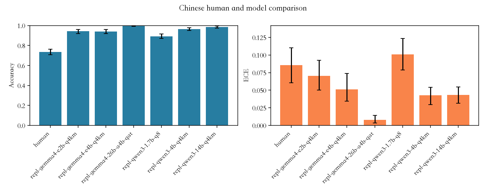
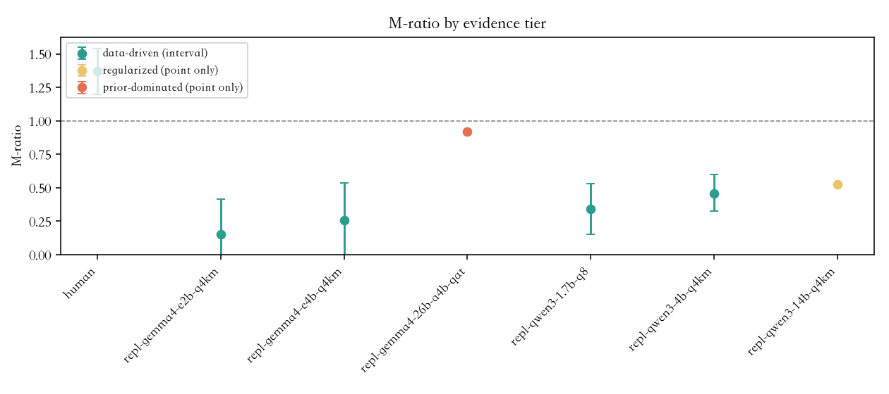
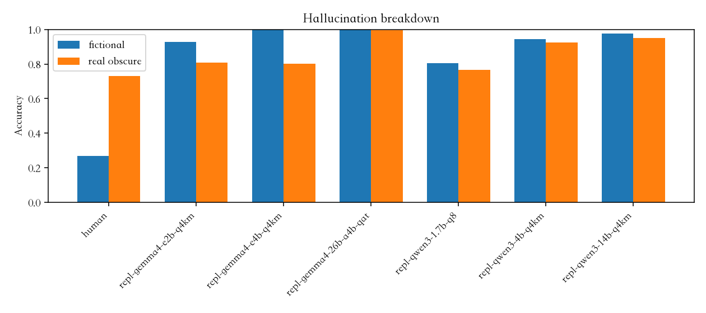
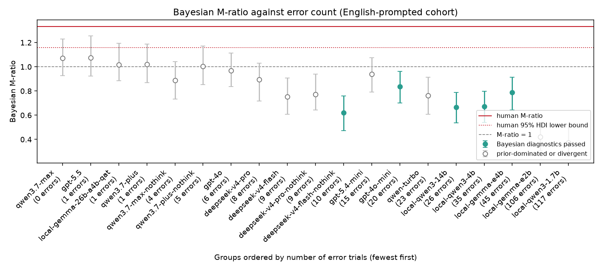

# Knowing What You Don’t Know: Behavioral Confidence Calibration in Humans and Large Language Models Across English- and Chinese-Prompted Cohorts

*Project SOCRATES — Self-knowledge Of Confidence: Rating And Testing Epistemic Sensitivity*

Lu Xin  
Mentor: Dr. ZeYu Zhang

## Abstract

Large language models (LLMs) can produce fluent answers even when those answers are wrong, making the usefulness of their expressed confidence a practical safety question. This study compares answer–confidence behavior in 46 Chinese-speaking participants (1,647 valid responses) and two model cohorts on a 400-item true/false bank. Nineteen configurations were prompted in English, and six locally served open-weight configurations were prompted in Chinese (9,600 attempts; 9,597 valid responses). All respondents used the same five-level confidence structure. Expected Calibration Error (ECE) measured aggregate calibration bias, while meta-d′/d′ (M-ratio) and Type-2 AUC measured confidence sensitivity conditional on first-order performance. The human cohort had ECE = .086 and a higher ECE than 17 of 19 English-prompted configurations by paired clustered-bootstrap comparison. In the Chinese-prompted cohort, mean model accuracy was .954 and mean ECE was .053, compared with .735 and .086 for humans; one configuration, Qwen3 1.7B Q8_0, had ECE = .101. The human MLE M-ratio was 1.370, whereas data-driven model estimates ranged from .310 to .690 in English and .152 to .458 in Chinese. On fictional versus real-but-obscure entities, humans showed near-zero answer-level discrimination (d′ = .001), whereas Chinese-prompted models ranged from 1.58 to 5.24. These findings describe different observable confidence patterns, not the presence or absence of metacognition, self-awareness, or consciousness. The Chinese-prompted cohort matches the human task language for six configurations, but differences in serving stack, model realization, and sampling prevent a causal interpretation of language.

*Keywords:* confidence calibration, large language models, meta-d′, M-ratio, hallucination, human–AI comparison

Large language models are increasingly used as sources of factual guidance, drafting assistance, and decision support. Their usefulness therefore depends on more than whether they are usually correct. Users also need to know whether a system’s stated confidence helps distinguish answers that deserve trust from answers that require checking. A fluent explanation can make an answer appear reliable even when it supplies no valid basis for that impression. In high-stakes settings, the relevant question is not whether a model can sound certain, but whether its expressed uncertainty tracks the limits of its performance.

That question sits near, but does not settle, the broader topic of metacognition. In human psychology, metacognition commonly concerns monitoring and regulating one’s own cognition (Flavell, 1979). In a language model, a verbal confidence rating is an output generated from learned representations, prompt conditioning, and decoding. The two kinds of report need not arise from the same mechanism. This study therefore uses the narrower term *behavioral confidence calibration*: the observable relation among an answer, a reported confidence level, and correctness under a predefined answer key. A common response format makes those behaviors comparable without assuming that humans and models possess the same internal process.

Three distinctions are central. First, first-order accuracy asks whether an answer is correct. Second, calibration bias asks whether average stated confidence is too high or too low relative to average accuracy. Third, confidence sensitivity asks whether confidence differentiates correct from incorrect answers. A respondent can be accurate and have low aggregate calibration error while still giving nearly the same confidence to correct and incorrect answers. Conversely, an above-chance confidence–correctness relationship does not demonstrate a separate introspective faculty. The study separates these quantities because collapsing them into one label such as “well calibrated” can conceal practically important failures.

The complete study includes one human cohort and two analytically distinct model cohorts. The human cohort answered the Chinese form of the bank. The English-prompted model cohort provides broad coverage across 19 local and hosted configurations. The Chinese-prompted open-weight cohort evaluates six configurations on the same Chinese task used by humans. The cohorts are reported separately because prompt language, model coverage, backend, quantization, and generation conditions are not identical. Together, they permit a more informative behavioral comparison than either one alone, while still leaving causal effects of language unresolved.

The study addresses three questions. First, how do first-order accuracy and calibration bias vary across the human cohort and the two model cohorts? Second, among groups with enough errors to estimate confidence sensitivity, how do Type-2 measures and M-ratios compare? Third, do responses to fictional versus real-but-obscure entities reveal a model-specific knowledge-boundary failure, a response bias, or a different pattern altogether? These are deliberately behavioral questions. The data can characterize reported answer–confidence behavior on this instrument; they cannot decide whether an LLM has consciousness or an internal metacognitive mechanism.

## Related Work

### Confidence and Self-Knowledge in Language Models

Research on LLM uncertainty uses several noninterchangeable signals. Calibration work typically compares a confidence estimate with empirical correctness, and Expected Calibration Error has become a common aggregate summary of their discrepancy (Guo et al., 2017). Geng et al. (2024) survey the wider methodological spectrum, from logit-based and sampling-based estimators through consistency methods to verbalized confidence, and show that these signals are not interchangeable either in what they measure or in how easily they can be elicited. Other work asks a model directly to judge whether it knows an answer, rather than relying solely on output probabilities. Kadavath et al. (2022) showed that the quality of such judgments depends strongly on the task and the way confidence is elicited. Yin et al. (2023) studied whether models can identify unanswerable questions and found both useful self-knowledge signals and a remaining gap relative to humans. These studies establish that uncertainty is measurable, but they also show that a single benchmark, prompt, or confidence format cannot define a model’s general capacity for self-monitoring.

Recent work makes the same point from different task domains. Scholten et al. (2024) use the term *metacognitive myopia* as a theoretical account of errors that arise when systems fail to monitor or regulate the information used in a decision. Griot et al. (2025) evaluate medical reasoning with explicit unknown and malformed questions and report that high first-order performance does not guarantee successful recognition of knowledge limitations. These results motivate careful tests of uncertainty, but they do not make a verbal confidence rating a direct observation of an internal monitor. The present study contributes a matched answer-and-confidence design rather than a test of an internal state.

### Human Confidence and Type-2 Measurement

Human metacognition research distinguishes Type-1 performance, such as making a true/false decision, from Type-2 performance, such as judging whether that decision is likely correct. Meta-d′ formalizes this distinction in a signal-detection framework. It estimates the Type-1 sensitivity that would be implied by the observed confidence ratings and compares it with observed d′; their ratio is M-ratio (Fleming & Lau, 2014). The normalization is useful when groups differ in first-order ability, but it is not assumption-free. It depends on a fitted evidence model, adequate correct and incorrect trials, and a meaningful relationship between the confidence scale and the decision process. Cacioli (2026) applies this framework to open-weight language models and draws out a further constraint: because meta-d′ presumes a two-alternative Type-1 decision, it is not well defined for open-ended question answering, where the paper substitutes Type-2 ROC measures instead. The present true/false task does supply a binary Type-1 decision and can therefore support the classical meta-d′ model, but it remains subject to that model’s assumptions. This is one reason the present analysis reports Type-2 AUC alongside M-ratio rather than relying on a single estimate.

This measurement boundary matters especially for high-performing LLMs. If a model makes only a handful of errors, its confidence sensitivity cannot be identified reliably: there are too few error trials to reveal whether confidence separated them from correct answers. A near-one M-ratio produced in that regime is not evidence of strong monitoring. It may be a consequence of sparse data or prior regularization. The present analysis therefore treats the number of errors as an evidence condition rather than treating all point estimates as equally informative.

### Explanations, Trust, and Functional Control

Natural-language explanations do not solve this problem automatically. An explanation may be persuasive without faithfully reflecting the information that determined the answer (Jacovi & Goldberg, 2020; Turpin et al., 2023). Steyvers et al. (2025) likewise show that users can misjudge model reliability from explanations even when a model’s own confidence signal contains some correctness-related information. For this reason, the current task asks models to give a minimal answer and discrete confidence report rather than asking the evaluator to infer uncertainty from prose length or rhetorical style.

Explicit confidence is still only one component of a fuller account of self-monitoring. A stronger functional test would ask whether a system uses uncertainty to abstain, seek evidence, allocate more reasoning, or revise an answer. The present paper does not test those control behaviors. It instead provides a transparent baseline: what can be inferred from answers and five-level confidence reports when humans and models face parallel knowledge items?

## Method

### Study Design and Respondent Cohorts

The study used a behaviorally symmetric design. Every respondent made a binary true/false judgment and then reported confidence on the same five-level structure. The human cohort consisted of 46 Chinese-speaking participants. The model side consisted of two cohorts: 19 configurations prompted in English and six locally served open-weight configurations prompted in Chinese. The use of two model cohorts improves coverage and creates one language-matched comparison, but it does not turn the resulting data into a randomized language experiment. The cohorts are therefore reported separately and never pooled.

The human cohort produced 1,647 valid responses. Each participant answered 36 randomly drawn items, nine from each item category; a small number of participants completed slightly fewer items. The English-prompted configurations generally attempted all 400 items four times under stochastic decoding. The Chinese-prompted configurations also attempted every item four times as independent, stateless requests. Each model sample is a repeated output from one configuration, not an independent model participant.

### Item Bank and Answer Key

The bank contained 400 source-checked statements, organized into four categories of 100 items each: ordinary knowledge, discipline-specific knowledge, plausible traps, and hallucination-triggering items. The categories were designed to prevent a single average accuracy score from hiding a category-specific failure pattern. Ordinary and disciplinary items measure conventional factual knowledge at different levels of specialization. Plausible traps test susceptibility to statements that are superficially credible but false. Hallucination-triggering items test knowledge-boundary behavior more directly.

The hallucination category contained 53 statements about author-created fictional entities, keyed False, and 47 statements about real but obscure entities, keyed True. This composition is important: it is not an exactly balanced 50/50 signal-detection set. In the subset analysis, fictional entities are treated as the signal and a False response as detection. A model that simply says False to any unfamiliar name would produce both hits on fictional statements and false alarms on real-but-obscure statements. Positive discrimination therefore cannot be explained by a blanket False-response bias alone, although it can still arise from training exposure, lexical familiarity, or item-writing cues rather than explicit awareness of ignorance.

The answer key represents the study’s current, source-checked standard. It does not imply that every incorrect response reflects irrationality or poor metacognition. A respondent can have a factually wrong answer while being appropriately confident given the evidence available to it, and a later change in scientific consensus could change the key. The analysis evaluates answer–confidence alignment under the stated key, not access to timeless or absolute truth.

### Procedure and Confidence Coding

Human participants saw Chinese statements and selected True or False followed by one of five confidence levels: pure guess, not very sure, half-and-half, fairly sure, or very sure. The model prompts requested the same answer sequence in a structured minimal response. English-prompted configurations received the English item bank; Chinese-prompted configurations received the Chinese item bank. Each Chinese model request included only the current item, so no conversational context was carried across trials.

For ECE, the five confidence categories were mapped to .50, .625, .75, .875, and 1.00. The .50 floor reflects the chance probability of a binary guess. Mapping “pure guess” to zero would impose a confidence interpretation that is incompatible with the task and would mechanically inflate calibration error. The mapping makes the aggregate calculation explicit, but it cannot guarantee that humans and models attach the same subjective meaning to the verbal labels.

The Chinese-prompted cohort comprised Gemma 4 E2B Q4_K_M, Gemma 4 E4B Q4_K_M, Gemma 4 26B-A4B QAT, Qwen3 1.7B Q8_0, Qwen3 4B Q4_K_M, and Qwen3 14B Q4_K_M. These configurations target the same base-model families and broadly similar quantization classes as local configurations in the English-prompted cohort. They were nevertheless served through a different runtime and hardware stack. The Chinese and English runs are therefore not bit-identical reruns of the same systems, and their contrast cannot identify a pure language effect.

Of 9,600 Chinese-prompted model attempts, 9,597 produced valid answer-and-confidence records. Two Gemma 4 26B-A4B QAT outputs and one Qwen3 4B Q4_K_M output were truncated or otherwise nonresponsive. They were retained in quality auditing but excluded from metric denominators. The human responses were collected once and serve as the common comparison group for both model cohorts; they are not two independent human samples.

Collection timing and model availability bear on how these results can be reproduced. The hosted endpoints for the English-prompted cohort were queried in June 2026. Several of them have since been retired or restricted, and a provider alias need not resolve to the same weights even when the name still responds. Exact *generative* reproduction is therefore not guaranteed for those configurations; what the retained logs support is *analytic* reproduction, in which the reported analyses are rerun on the stored outputs and metadata. This limitation does not weaken the case for replication with newer or additional models, because the item bank is already saturated for systems of this capability. Further configurations would still produce too few errors to identify confidence sensitivity, so what this instrument needs is harder items rather than newer respondents.

To keep the cohorts distinct, Chinese-prompted configurations are written in full (for example, *Gemma 4 E2B Q4_K_M*) and tagged **(CN)** in Table 1, while English-prompted ones use their short local identifiers (`local-gemma-e2b`, `local-qwen3-1.7b`). Because the same six checkpoints appear in both cohorts, a bare "Gemma E2B" would be ambiguous; every mention resolves to one cohort.

### Measures

**First-order performance and calibration bias.** Accuracy is the proportion of valid answers matching the key. Expected Calibration Error is the confidence-frequency-weighted absolute difference between stated confidence and observed accuracy within the five response categories (Guo et al., 2017). Low ECE means that average confidence is close to average accuracy on this task. It does not prove that confidence identifies errors, particularly when a group is near ceiling.

**Confidence sensitivity.** Type-2 AUC provides a model-free summary of how well confidence ranks correct above incorrect trials. Meta-d′ provides a model-based account in which the confidence ratings imply a Type-1 sensitivity, and M-ratio = meta-d′/d′ compares the two. Under the equal-variance model, an M-ratio near one means confidence used the same information as the Type-1 decision, below one indicates loss between decision and report, and above one is compatible with additional or post-decisional information. None of these values by itself proves the presence or absence of introspection, because pooling, unequal variances, and model misspecification can affect the estimate.

**Evidence tiers and uncertainty.** M-ratio was estimated at the group level because individual participants completed too few trials for stable individual estimates. The primary estimator was maximum-likelihood meta-d′ with nonparametric clustered-bootstrap intervals. Human uncertainty was clustered by participant; model uncertainty was clustered by item because four outputs from the same item are correlated. Bayesian HMeta-d estimates with 95% highest-density intervals supplied a regularizing cross-check.

The human cohort therefore has two sets of intervals. The ECE interval of [.062, .113] reported for the English comparison comes from the first analysis; the Chinese comparison uses the replication pipeline, which returns [.061, .110] for human ECE and [1.200, 1.538] for the human M-ratio. The two agree to within resampling noise, Table 1 reports the replication values so that the Chinese comparison comes from one pipeline, and no human responses were re-collected or altered.

Interpretation was gated by observed errors: data-driven groups had at least 30 errors, regularized groups had 10–29, and prior-dominated groups had fewer than 10. A Bayesian fit was considered reliable only when it had at least 10 errors, R-hat below 1.05, divergence rate below 5%, and finite interval bounds. These thresholds do not label a system as good or bad; they identify when the available data can support a substantive confidence-sensitivity estimate.

**Fictional-entity signal detection.** On the hallucination subset, log-linear-corrected d′ measures the ability to distinguish fictional from real-but-obscure entities. Criterion *c* measures response bias, with negative values indicating a tendency to answer False. This decomposition separates discrimination from bias, but it does not reveal whether the source of discrimination is memory, lexical cues, familiarity, or explicit knowledge-boundary monitoring.

### Scope of Inference

The two model cohorts share an item-bank structure and confidence scale, but they differ in prompt language, available models, serving systems, quantization, and generation conditions. The Chinese-prompted cohort removes the direct prompt-language mismatch when compared with the Chinese-speaking human cohort for its six configurations. It does not isolate the effect of language, generalize automatically to all 19 English-prompted configurations, or permit a parameter-size trend because family, active parameters, and quantization are confounded. Because of these differences the cohorts are reported separately and never pooled.

All human–model contrasts are group-level. Humans answered item subsets, whereas models answered the full bank repeatedly; participant-clustered and item-clustered resampling reflect those different sampling structures. No formal human-minus-model test was computed for each Chinese configuration. Accordingly, Chinese-cohort comparisons are described as observed point estimates and intervals, not causal or population-wide significance claims.

## Results

### First-Order Performance Across Cohorts

The pooled human cohort had accuracy = .735 across 1,647 valid responses. Its performance differed strongly by item type: .799 on ordinary items, .862 on discipline-specific items, .767 on plausible traps, and .509 on hallucination-triggering items. Thus, the aggregate human score masks a concentrated weakness on the knowledge-boundary subset.

The English-prompted model cohort generally achieved substantially higher first-order accuracy. Most configurations scored between .97 and 1.00, including on the hallucination subset. This high performance is substantively useful, but it also creates a measurement ceiling: models with zero or only a few errors cannot supply enough incorrect trials for a stable Type-2 analysis. The English cohort therefore offers broad first-order coverage but only a small subset of configurations that are informative for M-ratio.

The Chinese-prompted cohort showed the same ceiling issue at the high end while retaining more measurable variation among smaller configurations. Across the six Chinese-prompted configurations, unweighted mean accuracy was .954. Individual values ranged from .893 for Qwen3 1.7B Q8_0 to .997 for Gemma 4 26B-A4B QAT. Gemma 4 26B-A4B QAT produced only five errors and Qwen3 14B Q4_K_M produced 23, while Gemma 4 E2B Q4_K_M, Gemma 4 E4B Q4_K_M, Qwen3 1.7B Q8_0, and Qwen3 4B Q4_K_M produced 55–171 errors. The latter four groups consequently provide the clearest model-side evidence about confidence sensitivity.

### Calibration Bias

The human cohort had ECE = .086, with a participant-clustered bootstrap interval of [.062, .113]. In the English-prompted model cohort, paired clustered-bootstrap differences indicated that human ECE was higher than 17 of 19 configurations. The two exceptions were the weakest local configurations (`local-gemma-e2b` and `local-qwen3-1.7b`), for which the difference intervals included zero. This result describes calibration bias under the chosen confidence mapping; it does not imply that every model was more useful at recognizing its own mistakes.

For the Chinese-prompted cohort, the unweighted mean ECE was .053, compared with .086 for humans. Individual ECE ranged from .008 for Gemma 4 26B-A4B QAT to .101 for Qwen3 1.7B Q8_0. Therefore, the cohort average was lower than the human value, but not every configuration was. Qwen3 1.7B Q8_0 had ECE = .101, above the human point estimate. The observed pattern is that high model accuracy often coincided with low aggregate ECE on this bank, not that ECE created a uniform human–model ordering.

**Table 1**  
*Chinese-Prompted Model Cohort: Accuracy, Calibration, and M-ratio Evidence*

| Group | Valid *n* | Accuracy | ECE | Errors | MLE M-ratio | Evidence tier | Bayesian M-ratio [95% HDI] | Bayesian status |
|---|---:|---:|---:|---:|---:|---|---|---|
| Human cohort | 1,647 | .735 | .086 | 437 | 1.370 | Data-driven | 1.337 [1.147, 1.519] | Passed |
| Gemma 4 E2B Q4_K_M (CN) | 1,600 | .943 | .070 | 92 | .152 | Data-driven | .367 [.187, .544] | Passed |
| Gemma 4 E4B Q4_K_M (CN) | 1,600 | .941 | .051 | 94 | .259 | Data-driven | .399 [.241, .550] | Divergence criterion failed |
| Gemma 4 26B-A4B QAT (CN) | 1,598 | .997 | .008 | 5 | .920 | Prior-dominated | 1.079 [.900, 1.244] | Prior-dominated |
| Qwen3 1.7B Q8_0 (CN) | 1,600 | .893 | .101 | 171 | .344 | Data-driven | .405 [.245, .544] | Passed |
| Qwen3 4B Q4_K_M (CN) | 1,599 | .966 | .043 | 55 | .458 | Data-driven | .539 [.409, .654] | Passed |
| Qwen3 14B Q4_K_M (CN) | 1,600 | .986 | .043 | 23 | .527 | Regularized | .650 [.519, .782] | Divergence criterion failed |

*Note.* ECE = Expected Calibration Error; MLE = maximum-likelihood estimate; HDI = highest-density interval; M-ratio = meta-d′/d′; Q4_K_M = a mixed 4-bit K-quantization variant; Q8_0 = an 8-bit quantization variant; QAT = quantization-aware training. Evidence tiers are based on error counts: data-driven ≥30, regularized 10–29, prior-dominated <10. Only Bayesian rows marked Passed satisfy the prespecified diagnostic rule; other rows are reported for transparency but not interpreted.

**Figure 1**

*Accuracy and ECE for the Chinese-Speaking Human Cohort and Six Chinese-Prompted Model Configurations*

*Note.* ECE = Expected Calibration Error. Error bars are 95% clustered bootstrap intervals (participants for the human cohort, items for models); cohort means in the text are unweighted across the six configurations. The panels use separate scales because accuracy spans 0–1 while every ECE value is below .11. Here the human group has the second-highest ECE: Qwen3 1.7B Q8_0 (.101) exceeds it (.086).

### Confidence Sensitivity and the Measurement Ceiling

The English-prompted cohort illustrates why accuracy and ECE alone are insufficient. Only four English-prompted configurations met the data-driven error threshold. Their MLE M-ratios were .690 for `local-gemma-e4b`, .582 for `local-qwen3-4b`, .375 for `local-gemma-e2b`, and .310 for `local-qwen3-1.7b`. Their item-clustered bootstrap intervals were [.398, .922], [.402, .855], [.210, .531], and [.148, .499], respectively. The pooled human MLE M-ratio was 1.370 with a participant-clustered interval of [1.205, 1.543]. Those intervals describe fitted group-level estimates; they should not be converted into claims about each individual human or model instance.

The Chinese-prompted data-driven MLE estimates were .152 for Gemma 4 E2B Q4_K_M, .259 for Gemma 4 E4B Q4_K_M, .344 for Qwen3 1.7B Q8_0, and .458 for Qwen3 4B Q4_K_M. Each point estimate was below both one and the human point estimate. Their clustered-bootstrap intervals were wide, especially for Gemma 4 E2B Q4_K_M (−.189 to .418) and Gemma 4 E4B Q4_K_M (−.206 to .536). These negative lower endpoints are resampling or fitting artifacts, not meaningful negative metacognitive efficiency. The appropriate conclusion is descriptive: under the fitted model, the human estimate exceeded every data-driven Chinese-model point estimate, while no data-driven model point estimate exceeded one.

Because the HMeta-d posterior regularizes sparse-error groups instead of discarding them, an estimate exists for all 19 English-prompted configurations, and all 19 fall below the lower bound of the human interval (Figure 4). This is a wider comparison than the MLE threshold admits: nine configurations have at least 10 errors, and their estimates run from .620 (deepseek-v4-flash-nothink, 10 errors) to .941 (gpt-5.4-mini, 15 errors), the highest still below the human estimate. Figure 4 also shows why the threshold is not mere bookkeeping: below roughly 10 errors the estimates drift toward 1 as the posterior reverts to its prior, so the apparent convergence of near-ceiling models on M-ratio ≈ 1 reflects absent evidence rather than measured similarity. The human estimate was 1.337, 95% HDI [1.147, 1.519]. Three Chinese-prompted configurations passed the diagnostic rule: Gemma 4 E2B Q4_K_M, .367 [.187, .544]; Qwen3 1.7B Q8_0, .405 [.245, .544]; and Qwen3 4B Q4_K_M, .539 [.409, .654]. Gemma 4 E4B Q4_K_M had adequate errors but a 6.0% divergence rate. Qwen3 14B Q4_K_M was regularized and had a 17.1% divergence rate, while Gemma 4 26B-A4B QAT had five errors and was prior-dominated. Their posterior point estimates are displayed in Table 1 for completeness but do not establish a substantive ranking.

**Figure 2**

*MLE M-ratio Estimates by Evidence Tier*

*Note.* Error bars are 95% clustered bootstrap intervals (participants for the human cohort, items for models). The y-axis starts at zero, so the lower endpoints for Gemma 4 E2B Q4_K_M (−.189) and Gemma 4 E4B Q4_K_M (−.206) fall outside the plot and are named here instead. Intervals exist only for the data-driven tier, which the legend marks; the other two tiers are point estimates because their intervals are not estimable.

### Fictional Versus Real-Obscure Entities

The hallucination subset exposes a different first-order pattern: the human cohort achieved .269 accuracy on fictional-entity statements versus .731 on real-but-obscure ones, well below the .50 chance benchmark (binomial *p* = 6.6 × 10⁻¹¹, two-sided, 197 fictional trials). This aggregate is not driven by a few unusual items: 82% of the individual fictional items fall below 50% human accuracy, and removing the three worst items still leaves accuracy at .296 (*p* = 2.4 × 10⁻⁸). In the signal-detection analysis, human d′ was .001 and criterion was +.613. The low fictional-item accuracy therefore reflects a strong tendency to answer True rather than an answer-level ability to distinguish fictional from real-but-obscure entities. The human group also lowered confidence on fictional items, showing that a confidence shift and a correct boundary decision are not identical constructs.

In the English-prompted model cohort, answer-level discrimination on this subset ranged from d′ = 1.87 to 5.62. In the Chinese-prompted cohort, all six configurations again had positive discrimination, ranging from 1.58 for Qwen3 1.7B Q8_0 to 5.24 for Gemma 4 26B-A4B QAT. Chinese-prompted fictional-item accuracy ranged from .807 to 1.000. These results are inconsistent with purely indiscriminate responding, but they do not identify the cause of model discrimination. A model may recognize training-set entities, respond to lexical regularities, or use a learned familiarity signal without explicitly representing that it does not know something.

Response bias qualifies the comparison. All six Chinese-prompted model criteria were negative, from −.99 to −.07, indicating some tendency to answer False. The English-prompted model criteria were mixed, ranging from negative to positive values. Positive d′ shows that a blanket False bias cannot account for the full model pattern, because such a policy would increase false alarms on real-but-obscure entities as well as hits on fictional ones. At the same time, the change in criterion across cohorts shows why neither accuracy nor d′ alone should be treated as a language-invariant signature of boundary awareness.

**Figure 3**

*Accuracy on Fictional and Real-Obscure Items*

*Note.* The figure displays accuracy only. Signal-detection d′ and criterion values are reported in the text.

**Figure 4**

*Bayesian M-ratio Against Error Count for the English-Prompted Cohort*

*Note.* Filled markers are configurations that satisfied the prespecified Bayesian diagnostics; open markers were prior-dominated or divergent, and their intervals are not interpreted. The solid line is the human Bayesian M-ratio (1.337) and the dotted line the lower bound of its 95% HDI (1.147); all 19 model estimates fall below it. Groups are ordered from fewest to most errors, so the left of the figure is the least informative regime.

Type-2 AUC clarifies why low ECE cannot be equated with good uncertainty resolution. The human Type-2 AUC was .768, with a clustered interval of [.742, .792]. Across Chinese-prompted configurations it ranged from .510 to .725. Gemma 4 E2B Q4_K_M had ECE = .070 but Type-2 AUC = .510, nearly chance-level discrimination between correct and incorrect answers. Thus a group can appear well calibrated in the aggregate while its confidence supplies little information about which of its individual responses are likely wrong.

### Behavioral Hypotheses

The results permit only task-specific hypothesis adjudication. The strongest version of H1—that verbalized confidence is entirely unrelated to correctness—is not supported. Human Type-2 AUC was above chance, and several model groups with sufficient errors showed nonzero confidence sensitivity. This does not imply that model confidence is independent of learned verbal style or that it reflects an internal monitor.

H2—that model reports would show near-human confidence behavior on this instrument—is not supported within the data-driven range. The measurable English- and Chinese-prompted model M-ratios were below the pooled human estimate, while the strongest configurations could not be assessed reliably because of the ceiling. H3 predicted a model-specific collapse on hallucination-triggering items. That pattern was not observed: both model cohorts showed positive answer-level discrimination, whereas the pooled human group showed a strong True-response bias on fictional entities. This is a finding about this item bank and response format, not a reversal of hallucination research in general.

## Discussion

The main result is not that one respondent class possesses a mental faculty that the other lacks. It is that the groups display different observable combinations of first-order performance, calibration bias, confidence sensitivity, and response bias. The human cohort was less accurate overall and more overconfident on the chosen ECE mapping, yet it had higher fitted confidence sensitivity in the estimable groups. Models were more accurate and often had lower ECE, yet the configurations with enough errors generally showed weaker separation of correct from incorrect responses by confidence. Near-ceiling models form a third regime: they may be highly capable on the items, but this instrument does not produce enough errors to characterize their confidence sensitivity.

This separation between ECE and Type-2 measures is practically important. ECE summarizes whether average confidence agrees with average accuracy. It can be small when a model is almost always correct and reports high confidence, even if the model gives no useful warning for its rare errors. Type-2 AUC and meta-d′ address a different question: conditional on a mixture of correct and incorrect trials, does confidence rank them differently? Gemma 4 E2B Q4_K_M illustrates the distinction. Its Chinese-prompted ECE was comparatively low, but its Type-2 AUC was close to chance. An evaluator choosing a model for a safety-sensitive task should therefore examine both aggregate calibration and error discrimination rather than treating a single low ECE as sufficient evidence of reliable uncertainty.

The fictional-entity result is equally double-sided. The human cohort had near-zero answer-level discrimination but did lower confidence on fictional statements. This combination is compatible with an intuitive feeling of uncertainty that did not translate into the correct forced-choice response, perhaps because the response criterion favored apparently plausible claims. The model cohorts were much better at the binary discrimination, but the data do not show why. The models may have learned real entity names, detected stylistic differences, or followed a familiarity-based response policy. The result cannot establish that models explicitly recognize the boundary of their knowledge. It instead demonstrates why answer correctness, confidence level, response criterion, and knowledge-boundary behavior should be analyzed separately.

The two model cohorts strengthen the internal interpretation of the paper without removing its central limitations. For the six Chinese-prompted configurations, both humans and models received Chinese items, so their observed difference cannot be attributed simply to one group seeing Chinese while the other sees English. However, English and Chinese model runs also differ in serving backend, hardware, quantization realization, model availability, and generation behavior. It provides convergent behavioral evidence across two task-language settings, not a causal test of language.

Several design choices also limit generalization. The human cohort is modest and pooled; it cannot reveal stable individual differences in metacognitive sensitivity. Models received more trials than individual humans and were resampled by item rather than by independent agents. The five-level scale is shared structurally, but its subjective semantics may differ across respondent types. Author-created fictional items may contain lexical or stylistic cues, and real-but-obscure entities may differ in training exposure. Finally, the study measures retrospective verbal confidence only: it does not measure abstention, information seeking, or the use of uncertainty to control later behavior.

The practical implication is conservative. Confidence should be validated on the target task, with the target model, under the intended prompting and serving conditions. A system that performs well on a factual bank may still need an explicit abstention option, a retrieval step, or a verification policy when uncertainty is consequential. Future work should use paired bilingual runs of the same checkpoint, quantization, backend, and decoding policy; a new human cohort; harder or adaptive items that avoid the ceiling; and prospective feeling-of-knowing, abstention, or information-seeking choices. Of these, item difficulty is the binding constraint: adding newer configurations to the present bank would add respondents that the instrument cannot measure, whereas harder items would make the existing comparison informative again. Those interventions would test whether a confidence signal predicts and guides behavior, which is a stronger functional question than whether an answer is accompanied by a plausible confidence label.

## Conclusion

This study places one Chinese-speaking human cohort and two model cohorts on a common behavioral scale of answer, confidence, and correctness. The English-prompted cohort establishes broad model coverage across capability levels and vendors. The Chinese-prompted cohort then supplies a language-matched comparison for six open-weight configurations, so that for those six the human–model contrast no longer coincides with a prompt-language contrast. The central finding survives that control: under the fitted model the human confidence estimate lay above every estimable model estimate, and no data-driven model estimate in either cohort exceeded one, whereas the pooled human estimate did. The same pattern in both language settings makes a purely English-wording explanation of model confidence less plausible than it would have been from the English cohort alone.

Humans and models also differed in the kind of failure they displayed. The human group showed higher fitted confidence sensitivity in estimable comparisons, yet a pronounced True-response bias on fictional entities produced below-chance accuracy there. The measurable model groups showed higher first-order accuracy but lower fitted M-ratios and near-ceiling systems could not be evaluated reliably with this instrument. Confidence resolution and knowledge-boundary classification therefore came apart in opposite directions in the two groups, which is the strongest reason to treat them as separate constructs. These findings support careful, task-specific evaluation of verbalized confidence. They do not determine whether a model possesses metacognition, self-awareness, or consciousness.

## References

Cacioli, J.-P. (2026). Do LLMs know what they know? Measuring metacognitive efficiency with signal detection theory. *arXiv*. https://doi.org/10.48550/arXiv.2603.25112

Flavell, J. H. (1979). Metacognition and cognitive monitoring: A new area of cognitive-developmental inquiry. *American Psychologist, 34*(10), 906–911. https://doi.org/10.1037/0003-066X.34.10.906

Fleming, S. M., & Lau, H. C. (2014). How to measure metacognition. *Frontiers in Human Neuroscience, 8*, Article 443. https://doi.org/10.3389/fnhum.2014.00443

Geng, J., Cai, F., Wang, Y., Koeppl, H., Nakov, P., & Gurevych, I. (2024). A survey of confidence estimation and calibration in large language models. In *Proceedings of the 2024 Conference of the North American Chapter of the Association for Computational Linguistics: Human Language Technologies (Volume 1: Long Papers)* (pp. 6577–6595). Association for Computational Linguistics. https://doi.org/10.18653/v1/2024.naacl-long.366

Griot, M., Hemptinne, C., Vanderdonckt, J., & Yuksel, D. (2025). Large language models lack essential metacognition for reliable medical reasoning. *Nature Communications, 16*, Article 642. https://doi.org/10.1038/s41467-024-55628-6

Guo, C., Pleiss, G., Sun, Y., & Weinberger, K. Q. (2017). On calibration of modern neural networks. In D. Precup & Y. W. Teh (Eds.), *Proceedings of the 34th International Conference on Machine Learning* (Vol. 70, pp. 1321–1330). PMLR.

Jacovi, A., & Goldberg, Y. (2020). Towards faithfully interpretable NLP systems: How should we define and evaluate faithfulness? In *Proceedings of the 58th Annual Meeting of the Association for Computational Linguistics* (pp. 4198–4205). Association for Computational Linguistics. https://doi.org/10.18653/v1/2020.acl-main.386

Kadavath, S., Conerly, T., Askell, A., Henighan, T., Drain, D., Perez, E., Schiefer, N., Hatfield-Dodds, Z., DasSarma, N., Tran-Johnson, E., … Kaplan, J. (2022). Language models (mostly) know what they know. *arXiv*. https://doi.org/10.48550/arXiv.2207.05221

Scholten, F., Rebholz, T. R., & Hütter, M. (2024). Metacognitive myopia in large language models. *arXiv*. https://doi.org/10.48550/arXiv.2408.05568

Steyvers, M., Tejeda, H., Kumar, A., Belem, C., Karny, S., Hu, X., Mayer, L., & Smyth, P. (2025). What large language models know and what people think they know. *Nature Machine Intelligence, 7*, 221–231. https://doi.org/10.1038/s42256-024-00976-7

Turpin, M., Michael, J., Perez, E., & Bowman, S. R. (2023). Language models don’t always say what they think: Unfaithful explanations in chain-of-thought prompting. In A. Oh, T. Naumann, A. Globerson, K. Saenko, M. Hardt, & S. Levine (Eds.), *Advances in Neural Information Processing Systems* (Vol. 36, pp. 74952–74965). Curran Associates.

Yin, Z., Sun, Q., Guo, Q., Wu, J., Qiu, X., & Huang, X. (2023). Do large language models know what they don’t know? In *Findings of the Association for Computational Linguistics: ACL 2023* (pp. 8653–8665). Association for Computational Linguistics. https://doi.org/10.18653/v1/2023.findings-acl.551
